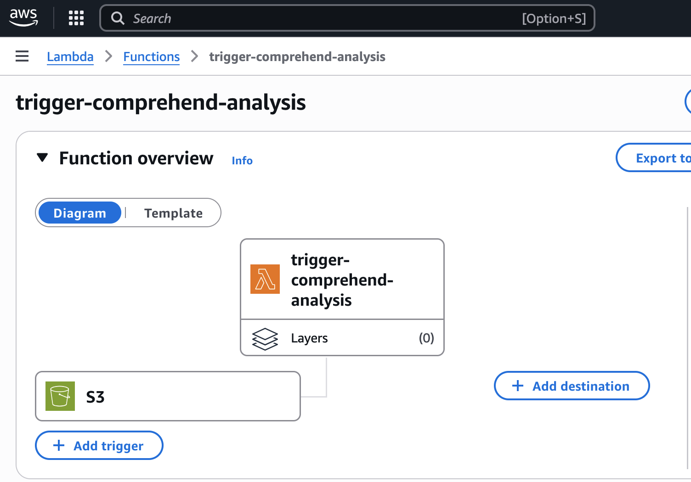
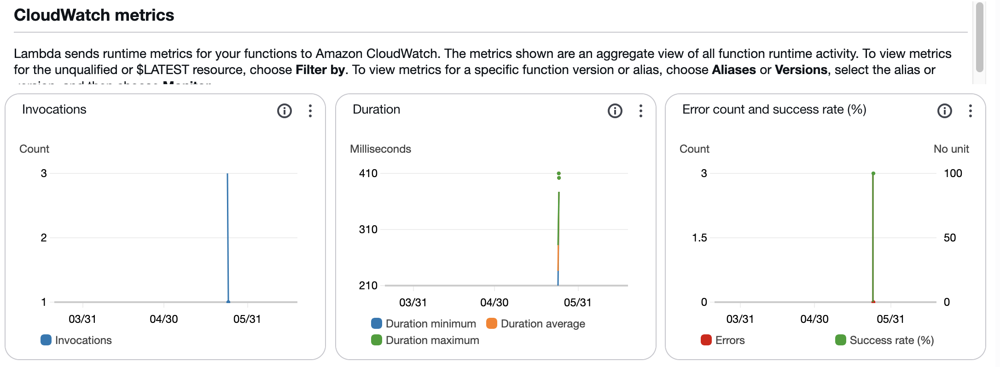
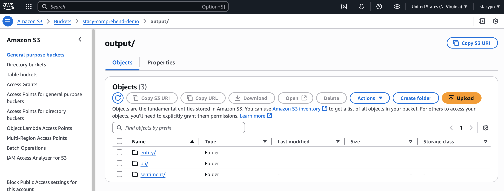
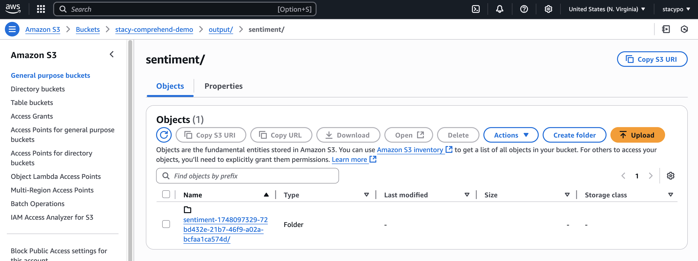
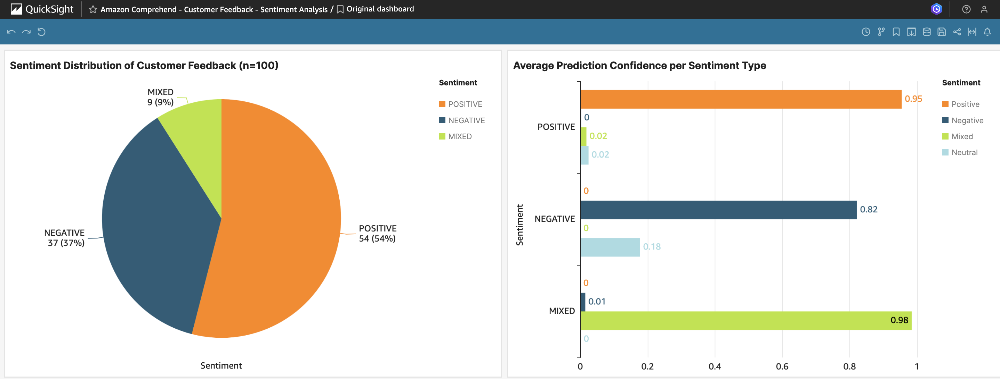
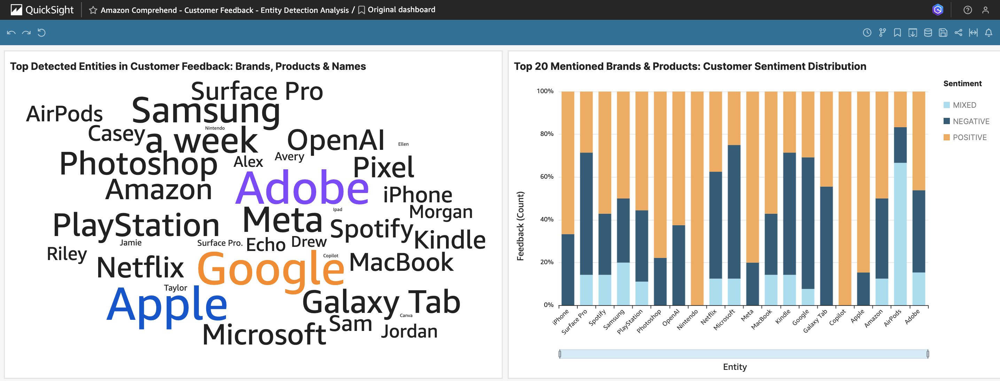

# Sentiment Analyzer on AWS
Analyze customer feedback at scale with real-time sentiment and entity detection using AWS services.

---

## Project Overview
This project demonstrates an event-driven AI pipeline on AWS that:
- Accepts a batch of customer reviews in CSV format
- Automatically triggers analysis when the file is uploaded to Amazon S3
- Uses Amazon Comprehend to perform:
  - **Sentiment analysis**
  - **Entity detection**
- Stores processed results back into S3
- Visualizes insights using Amazon QuickSight

---

## Architecture

- **Amazon S3**: Uploads batch of 100 customer review CSV files
- **AWS Lambda**: Triggered by S3 `ObjectCreated` event
- **Amazon Comprehend**: Performs sentiment and entity detection on each review
- **S3**: Stores the results in a designated output folder
- **Amazon QuickSight**: Visualizes sentiment distribution and entity frequency
- Built fully on AWS Free Tier (Comprehend, Lambda, S3, QuickSight)

---

## How It Works

1. User uploads a CSV file containing 100 customer reviews to an S3 bucket.
2. S3 event triggers a Lambda function (Python), which:
   - Reads the CSV
   - Sends each review to Amazon Comprehend via Boto3
   - Extracts sentiment and entities
3. Lambda saves the analysis results (CSV) to another S3 bucket/folder.
4. Amazon QuickSight is configured to ingest the new result files from S3 for visualization
5. QuickSight dashboard with filters and comparison charts

---

## Key AWS Features Used

- **S3 Event Notification** to trigger computation
- **Lambda (Python)** with `boto3` to control Comprehend
- **Comprehend APIs:**
  - `DetectSentiment`
  - `DetectEntities`
- **QuickSight** dataset connecting from S3 output bucket using Manifest file

---

## Demo Screenshots

### 📁 1. S3 File Upload

### ⚙️ 2A. Lambda Function Diagram

### 📊 2B. CloudWatch Metrics

### 📂 3A. S3 Output Folder View

### 📄 3B. Output File in Sentiment Folder

### 📈 4A. QuickSight Sentiment Dashboard

### 🧠 4B. QuickSight Entity Dashboard

---

## Tech Stack

| Component | Service |
|----------|---------|
| Text Analysis | Amazon Comprehend |
| Event Trigger | Amazon S3 |
| Compute | AWS Lambda |
| Storage | Amazon S3 |
| Visualization | Amazon QuickSight |

---

## Possible Improvements

- Add support for multi-language sentiment (Comprehend supports EN/ES/FR/DE)
- Replace CSV parsing with streaming (for large files)
- Add SNS notification or email report when analysis completes

---

## 📄 License

MIT © Stacy Po
